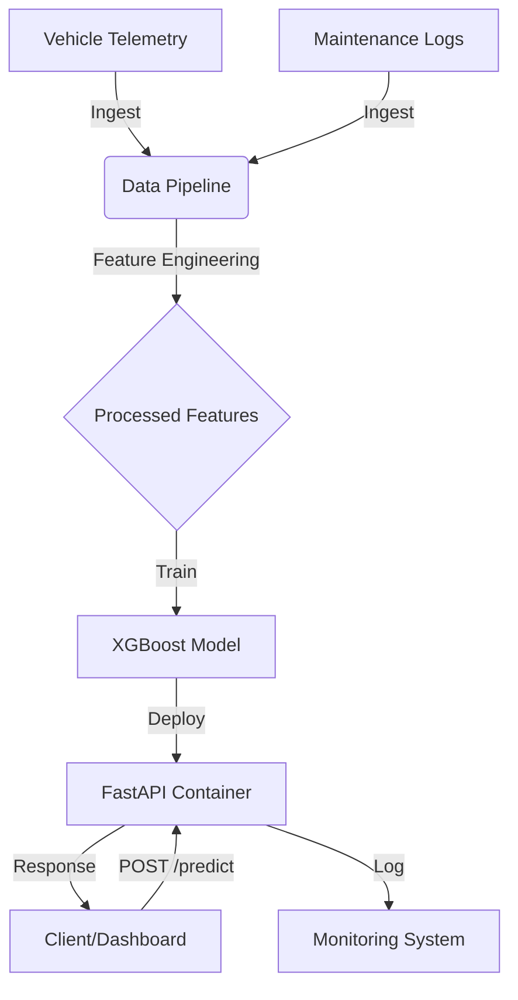

# DPF Soot Load Prediction System

## Overview
This repository contains a full-stack predictive maintenance system for DPF (Diesel Particulate Filter) soot load estimation. It includes synthetic data generation, feature engineering, XGBoost model training, and a production-ready FastAPI serving layer.

**Key Features:**
- **Data Generator**: Simulates 10+ vehicles with realistic physics (load, temperature, regen events).
- **Pipeline**: Robust feature engineering (rolling temps, cumulative distance since regen).
- **Model**: XGBoost Regressor trained with MLflow tracking (RMSE ~0.87%).
- **Serving**: Dockerized FastAPI app for real-time inference.

## Architecture


## Project Structure
```
.
├── src/
│   ├── data/          # Generator logic
│   ├── features/      # Pipeline logic
│   ├── models/        # Train script
│   └── serving/       # API app
├── tests/             # Unit tests
├── Dockerfile         # Container definition
└── requirements.txt   # Dependencies
```

## Setup & Running

### 1. Installation
```bash
# Clone repo
git clone <repo-url>
cd tensor-planet-intern

# Install dependencies (requires python 3.9+)
pip install -r requirements.txt
# Mac users: brew install libomp
```

### 2. End-to-End Workflow
```bash
# 1. Generate Synthetic Data
python3 src/data/generator.py
# Output: data/*.csv

# 2. Run Feature Pipeline (creates processed_Features.csv)
python3 src/features/pipeline.py

# 3. Train Model
python3 src/models/train.py
# Output: models/xgb_model.json
```

### 3. Run API (Local)
```bash
uvicorn src.serving.main:app --reload
```
Test with: `http://localhost:8000/docs`

### 4. Run with Docker
```bash
docker build -t dpf-predictor .
docker run -p 8000:8000 dpf-predictor
```

## Testing
Run the test suite:
```bash
pytest tests/
```
